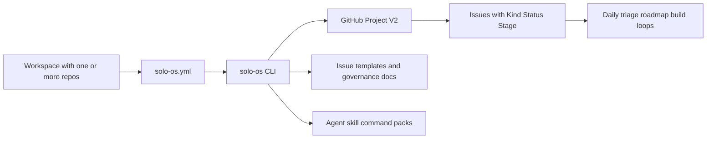

# Solo OS

Solo OS is a GitHub Projects V2 operating layer for solo builders and small teams who want clear execution loops instead of planning chaos.

It combines a CLI, issue templates, and AI agent/skill packs so one workspace can move cleanly from idea -> roadmap -> build loop -> release learning.

## Why Solo OS

- Keep active planning state in GitHub Projects and issues, not scattered notes.
- Run a repeatable build loop rhythm with explicit scope, validation, and rollback thinking.
- Get useful daily triage and next-action answers from your live project state.
- Adopt in layers, from lightweight CLI usage to deeper AI-assisted workflows.

## System Overview




## Tiered Adoption

### Tier 1: Daily clarity in minutes

- Run `solo-os init`, then `solo-os daily-triage` and `solo-os gh-next`.
- Use it as your planning cockpit without changing your code workflow.

### Tier 2: Build loop discipline

- Use canonical Build Loop templates and `solo-os bl-review`.
- Keep each loop bounded with explicit non-goals and release checks.

### Tier 3: AI workflow assistance

- Install agent, skill, and command packs for supported IDEs.
- Standardize prompt quality and decision framing across loops.

### Tier 4: Full operating system

- Run weekly maintenance and audit routines (`weekly-cycle`, `sync-audit`).
- Treat Solo OS as the execution substrate across multiple repos.

## Quick Start

### 1) Install prerequisites

**macOS (Homebrew)**

```bash
brew install gh git python pipx
gh auth login
gh auth refresh --scopes project
```

**Linux (apt)**

```bash
sudo apt install git python3 python3-pip pipx
pipx ensurepath
# Install gh: https://github.com/cli/cli/blob/trunk/docs/install_linux.md
gh auth login
gh auth refresh --scopes project
```

**Windows**

```bash
winget install GitHub.cli Git.Git Python.Python.3 pipx
gh auth login
gh auth refresh --scopes project
```

Validate auth scope:

```bash
gh auth status
```

### 2) Install Solo OS

```bash
pipx install git+https://github.com/ScoopedOutStudios/solo-os.git
```

### 3) Initialize from workspace root

```bash
cd ~/my-workspace
solo-os init
solo-os verify
```

### 4) Run your first triage loop

```bash
solo-os daily-triage
solo-os gh-list
solo-os gh-brief --question active-work
```

If these commands run, your baseline setup is complete.

## Architecture Walkthrough

### Workspace model

Solo OS is workspace-level, not repo-level. One `solo-os.yml` file configures one or more repos:

```text
# Single-repo workspace             # Multi-repo workspace
my-project/                          my-workspace/
  solo-os.yml                          solo-os.yml
  src/                                 app-backend/
  ...                                  app-frontend/
                                       marketing-site/
```

### Config discovery order

1. `SOLO_OS_ROOT` environment override
2. Walk-up discovery from current directory
3. XDG fallback at `~/.config/solo-os/config.yml`

### GitHub as source of truth

Solo OS currently supports GitHub Projects V2 only. Issues are managed with structured fields such as `Kind`, `Status`, and `Stage`, and CLI commands operate against that state.

## Command Surface


| Command                           | Description                                                                   |
| --------------------------------- | ----------------------------------------------------------------------------- |
| `solo-os init`                    | Guided setup for `solo-os.yml` and GitHub Project fields                      |
| `solo-os verify`                  | Validate environment, config, and project setup                               |
| `solo-os daily-triage`            | Review stages, flag WIP violations, suggest moves                             |
| `solo-os gh-list`                 | List project-backed GitHub issues                                             |
| `solo-os gh-next`                 | Show next actionable items                                                    |
| `solo-os gh-brief --question <q>` | Answer planning questions (`active-work`, `roadmap-now`, `in-progress-ideas`) |
| `solo-os gh-update`               | Update issue content and/or project fields                                    |
| `solo-os gh-promote`              | Promote an issue to a different Kind                                          |
| `solo-os gh-close`                | Close an issue and sync project status                                        |
| `solo-os gh-migrate-titles`       | Rename legacy workflow issue prefixes                                         |
| `solo-os bl-review`               | Review Build Loop Checkpoint A readiness                                      |
| `solo-os bl-status`               | Show open Build Loop issues across repos                                      |
| `solo-os sync-audit`              | Run local sync audit checks                                                   |
| `solo-os cleanup-markdown`        | Archive redundant markdown artifacts                                          |
| `solo-os weekly-cycle`            | Run weekly maintenance (`sync-audit` + `cleanup-markdown`)                    |
| `solo-os build-loop-template`     | Print canonical issue body templates                                          |
| `solo-os install-agents`          | Install agent specs (`--ide cursor\|claude-code`)                            |
| `solo-os install-skills`          | Install skill specs (`--ide cursor\|claude-code\|codex`)                     |
| `solo-os install-commands`        | Install command packs (`--ide cursor\|claude-code`)                          |


## Documentation Strategy

The chosen structure for now is:

- Keep one hero `README.md` as the first-stop onboarding and narrative.
- Keep deeper references in `docs/` and the packaged templates/spec assets.
- Split further only when user feedback shows the hero README is too dense.

Current core references:

- `docs/workflow-spec.md`
- `docs/governance/build-loop-and-release-rhythm.md`
- `solo_os/templates/` for issue body templates

## Init Examples

```bash
# Interactive
solo-os init

# Existing GitHub Project
solo-os init --yes --owner my-org --project 7

# Create a new GitHub Project
solo-os init --yes --owner my-org --project-title "Solo OS Planning"

# Auto-detect your GitHub username
solo-os init --owner @me
```

## Contributing

Contributions are welcome. For now, open an issue describing the problem, proposed behavior, and how it fits the Solo OS workflow model.

## Development

```bash
git clone https://github.com/ScoopedOutStudios/solo-os.git
cd solo-os
pipx install -e .
python3 -m solo_os --help
```

