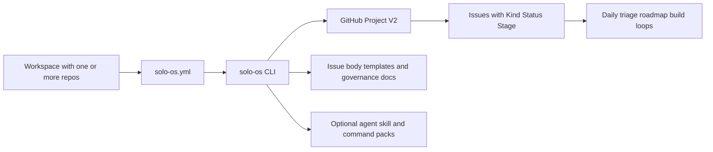

# Solo OS

[CI](https://github.com/ScoopedOutStudios/solo-os/actions/workflows/ci.yml)
[License: MIT](https://github.com/ScoopedOutStudios/solo-os/blob/main/LICENSE)
[Python 3.10+](https://www.python.org/downloads/)

Solo OS is a GitHub Projects V2 operating layer for solo builders and small teams who want clear execution loops instead of planning chaos.

It combines a **CLI**, **governance and issue-body templates** in the package, and **optional** AI agent, skill, and command packs so one workspace can move cleanly from **idea → roadmap → build loop → release learning**.

**Contents:** [Why Solo OS](#why-solo-os) · [Start here (new user)](#start-here-for-new-users) · [System overview](#system-overview) · [Tiered adoption](#tiered-adoption) · [Quick start](#quick-start) · [Use the bundled AI assets](#use-the-bundled-ai-assets) · [Command surface](#command-surface) · [Configuration](#architecture-walkthrough) · [Docs index](#documentation-index)

## Start here for new users

- **If you have not run Solo OS yet:** follow [Quick start](#quick-start) (install, `init`, `verify`).
- **If your GitHub Project has no issues yet:** the CLI will look empty until issues exist **on the project** with `Kind` / `Status` / `Stage` set. Read the full guide: run `solo-os onboarding` after install, or open `[solo_os/templates/user-guide-getting-started.md](solo_os/templates/user-guide-getting-started.md)` in this repo. That guide covers the **idea → triage → roadmap → build loop** path and which **skills / commands / agents** to use first.
- **If you are adopting AI assistance in Cursor, Claude Code, or Codex:** see [Use the bundled AI assets](#use-the-bundled-ai-assets) and the tables in `[skills/README.md](skills/README.md)`, `[commands/README.md](commands/README.md)`, and `[agents/README.md](agents/README.md)`.

## Why Solo OS

- Keep active planning state in GitHub Projects and issues, not scattered notes.
- Run a repeatable build loop rhythm with explicit scope, validation, and rollback thinking.
- Get useful daily triage and next-action answers from your live project state.
- Adopt in layers, from lightweight CLI usage to deeper AI-assisted workflows.

## System Overview




## Tiered Adoption

### Tier 1: Daily clarity in minutes

- Run `solo-os init`, then `solo-os verify` and `solo-os onboarding` (read the empty-project and workflow section once).
- With issues on your board, use `solo-os daily-triage` and `solo-os gh-next` as your planning cockpit without changing your code workflow.

### Tier 2: Build loop discipline

- Use canonical Build Loop templates and `solo-os bl-review`.
- Keep each loop bounded with explicit non-goals and release checks.

### Tier 3: AI workflow assistance

- Install agent, skill, and command packs for supported IDEs.
- Standardize prompt quality and decision framing across loops.

### Tier 4: Full operating system

- Run weekly maintenance and audit routines (`weekly-cycle`, `sync-audit`).
- Treat Solo OS as the execution substrate across multiple repos.

## Quick Start

### 1) Install prerequisites

**macOS (Homebrew)**

```bash
brew install gh git python pipx
gh auth login
gh auth refresh --scopes project
```

**Linux (apt)**

```bash
sudo apt install git python3 python3-pip pipx
pipx ensurepath
# Install gh: https://github.com/cli/cli/blob/trunk/docs/install_linux.md
gh auth login
gh auth refresh --scopes project
```

**Windows**

```bash
winget install GitHub.cli Git.Git Python.Python.3 pipx
gh auth login
gh auth refresh --scopes project
```

Validate auth scope:

```bash
gh auth status
```

### 2) Install Solo OS

```bash
pipx install git+https://github.com/ScoopedOutStudios/solo-os.git
```

### 3) Initialize from workspace root

```bash
cd ~/my-workspace
solo-os init
solo-os verify
solo-os onboarding
```

`onboarding` prints a markdown guide: what to do when the project is empty, the idea → roadmap → build loop, and how to use the installed agent/skill/command packs. You can also browse the [documentation index](docs/README.md) or the [workflow spec](docs/workflow-spec.md).

**Empty project?** The CLI can look “blank” until at least one issue exists **on the project** with `Kind` / `Status` / `Stage` set. If you are unsure what to create first, run `solo-os workflow-start`.

**Fast path (CLI):** create a project-backed issue from the bundled body templates and set the Project fields in one step:

```bash
solo-os gh-create --repo <owner/name> --title "[Idea] My first idea" --from-template idea --kind Idea --status Todo --stage Inbox
```

### 4) Run your first triage loop

```bash
solo-os daily-triage
solo-os gh-list
solo-os gh-brief --question active-work
```

If `gh-list` or `gh-next` show no rows, you likely need to **add at least one issue to the project** in GitHub and set its project fields (see the onboarding guide).

## Use the bundled AI assets

Solo OS ships **skills** (repeatable `SKILL.md` workflows), **IDE slash-commands** (for Cursor/Claude Code; see `commands/`), and **agent** role specs (e.g. PM, eng lead) you install with the CLI. They are **optional**: the CLI and GitHub project remain the source of truth for state.

Install behavior works from both a source checkout and a normal `pipx`/wheel install. Agents and skills install to your global IDE profile by default. Commands install to the workspace root discovered from `solo-os.yml` (falling back to the current directory only if no config is found), so you do not need to run the command from one exact folder inside a configured workspace.

1. **Install the packs** (from a repo in your workspace, or pass `--target` to match your tool’s paths):
  ```bash
   solo-os install-skills
   solo-os install-commands
   solo-os install-agents
  ```
2. **When to use what**
  - **Skill** — You want a structured workflow with steps and outputs (e.g. `idea-triage`, `mvp-scope-and-roadmap`, `build-loop-and-release-rhythm`). Good for a focused task; works across supported IDEs.
  - **Slash-command** — You work in the editor and want one prompt for a Solo OS step (`idea-triage`, `roadmap-plan`, `bl-create`, `daily-triage` in the command pack). See the list in `[commands/README.md](commands/README.md)`.
  - **Sub-agent** — You need a **role** (review, PM, design, CoS) with ongoing instructions. Install with `install-agents` and invoke the agent in your tool; see `[agents/README.md](agents/README.md)`.
3. **A minimal happy path** for a new product thread: `idea-triage` (command or skill) to shape the first GitHub issue → set project fields → `mvp-scope-and-roadmap` or `roadmap-plan` for committed bets → `bl-create` / `bl-execute` and CLI `bl-review` when you enter execution. Details are in `solo-os onboarding` and `[docs/workflow-spec.md](docs/workflow-spec.md)`.

## Architecture Walkthrough

### Workspace model

Solo OS is workspace-level, not repo-level. One `solo-os.yml` file configures one or more repos:

```text
# Single-repo workspace             # Multi-repo workspace
my-project/                          my-workspace/
  solo-os.yml                          solo-os.yml
  src/                                 app-backend/
  ...                                  app-frontend/
                                       marketing-site/
```

### Config discovery order

1. `SOLO_OS_ROOT` environment override
2. Walk-up discovery from current directory
3. XDG fallback at `~/.config/solo-os/config.yml`

### GitHub as source of truth

Solo OS currently supports GitHub Projects V2 only. Issues are managed with structured fields such as `Kind`, `Status`, and `Stage`, and CLI commands operate against that state.

## Command Surface


| Command                           | Description                                                                   |
| --------------------------------- | ----------------------------------------------------------------------------- |
| `solo-os init`                    | Guided setup for `solo-os.yml` and GitHub Project fields                      |
| `solo-os onboarding`              | Print the getting-started guide (empty project, workflow, AI packs)           |
| `solo-os verify`                  | Validate environment, config, and project setup                               |
| `solo-os daily-triage`            | Review stages, flag WIP violations, suggest moves                             |
| `solo-os gh-list`                 | List project-backed GitHub issues                                             |
| `solo-os gh-next`                 | Show next actionable items grouped by Kind                                    |
| `solo-os gh-brief --question <q>` | Answer planning questions (`active-work`, `roadmap-now`, `in-progress-ideas`) |
| `solo-os gh-create`               | Create an issue and add it to the Project (optionally set Kind/Status/Stage)  |
| `solo-os gh-update`               | Update issue content and/or project fields                                    |
| `solo-os gh-promote`              | Promote an issue to a different Kind                                          |
| `solo-os gh-close`                | Close an issue and sync project status                                        |
| `solo-os gh-migrate-titles`       | Rename legacy workflow issue prefixes                                         |
| `solo-os bl-review`               | Review Build Loop Checkpoint A readiness                                      |
| `solo-os bl-status`               | Show open Build Loop issues across repos                                      |
| `solo-os sync-audit`              | Run local sync audit checks                                                   |
| `solo-os cleanup-markdown`        | Archive redundant markdown artifacts                                          |
| `solo-os weekly-cycle`            | Run weekly maintenance (`sync-audit` + `cleanup-markdown`)                    |
| `solo-os build-loop-template`     | Print canonical issue body templates                                          |
| `solo-os workflow-start`          | Print a guided Idea → Roadmap → Build Loop tour (CLI-first)                   |
| `solo-os install-agents`          | Install agent specs (`--ide cursor|claude-code`; optional `--target`)         |
| `solo-os install-skills`          | Install skill specs (`--ide cursor|claude-code|codex`; optional `--target`)   |
| `solo-os install-commands`        | Install command packs (`--ide cursor|claude-code`; optional `--target`)       |


## Documentation index

The README is the **landing page**: install, first steps, and where to go next. Deeper material lives under `docs/` and in the package (`solo_os/templates/` for issue body templates, `user-guide-getting-started.md` for the same text as `solo-os onboarding`).

- **[docs/README.md](docs/README.md)** — Hub with links to all guides and the bundled `skills/`, `commands/`, and `agents/` tables.
- **[docs/workflow-spec.md](docs/workflow-spec.md)** — Kind, Status, Stage semantics and lifecycles.
- **[docs/governance/build-loop-and-release-rhythm.md](docs/governance/build-loop-and-release-rhythm.md)** — Build loop rhythm and release thinking.
- **[solo_os/templates/user-guide-getting-started.md](solo_os/templates/user-guide-getting-started.md)** — New-user and empty-project guide (also: `solo-os onboarding`).

**README layout (what we optimize for):** *above the fold* = what the project is, who it is for, and **Start here**; **Quick start** is copy-paste; **use the bundled AI assets** is the showcase for sub-agents and skills; long tables and config details stay scannable. Everything else is linked rather than embedded. (See also GitHub’s [About READMEs](https://docs.github.com/en/repositories/managing-your-repositorys-settings-and-features/customizing-your-repository/about-readmes) and [repository best practices](https://docs.github.com/en/repositories/creating-and-managing-repositories/best-practices-for-repositories).)

## Init Examples

```bash
# Interactive
solo-os init

# Existing GitHub Project
solo-os init --yes --owner my-org --project 7

# Create a new GitHub Project
solo-os init --yes --owner my-org --project-title "Solo OS Planning"

# Auto-detect your GitHub username
solo-os init --owner @me
```

## Contributing

Contributions are welcome.

- Start with `CONTRIBUTING.md` for contribution workflow and quality expectations.
- See `SECURITY.md` for responsible vulnerability disclosure.
- Open an issue describing the problem, proposed behavior, and how it fits the Solo OS workflow model.

## Development

```bash
git clone https://github.com/ScoopedOutStudios/solo-os.git
cd solo-os
pipx install -e .
python3 -m solo_os --help
```

