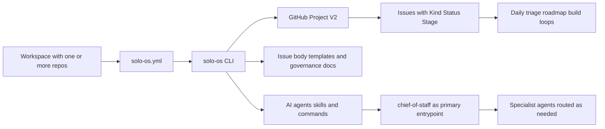

# Solo OS

[CI](https://github.com/ScoopedOutStudios/solo-os/actions/workflows/ci.yml)
[License: MIT](https://github.com/ScoopedOutStudios/solo-os/blob/main/LICENSE)
[Python 3.10+](https://www.python.org/downloads/)

Solo OS is a GitHub Projects V2 operating layer for solo builders and small teams who want clear execution loops instead of planning chaos.

It combines a **CLI**, **governance and issue-body templates** in the package, and **AI agent, skill, and command packs** so one workspace can move cleanly from **idea → roadmap → build loop → release learning**.

**Contents:** [Start here](#start-here-for-new-users) · [Quick start](#quick-start) · [How to use Solo OS](#how-to-use-solo-os) · [Tiered adoption](#tiered-adoption) · [System overview](#system-overview) · [Configuration](#architecture-walkthrough) · [Docs index](#documentation-index)

## Start here for new users

1. Follow [Quick start](#quick-start) to install, `init`, `verify`.
2. Install the AI packs: `solo-os install-agents && solo-os install-skills && solo-os install-commands`
3. **Ask `chief-of-staff` what to do next.** It handles workflow-object creation (Ideas, Roadmap bets, Build Loops) directly and routes deeper work to specialist agents as needed.

That's it. `chief-of-staff` is the primary interface — it knows the CLI commands, the workflow model, and when to involve specialists.

## Quick Start

### 1) Install prerequisites

**macOS (Homebrew)**

```bash
brew install gh git python pipx
gh auth login
gh auth refresh --scopes project
```

**Linux (apt)**

```bash
sudo apt install git python3 python3-pip pipx
pipx ensurepath
# Install gh: https://github.com/cli/cli/blob/trunk/docs/install_linux.md
gh auth login
gh auth refresh --scopes project
```

**Windows**

```bash
winget install GitHub.cli Git.Git Python.Python.3 pipx
gh auth login
gh auth refresh --scopes project
```

Validate auth scope:

```bash
gh auth status
```

### 2) Install Solo OS

```bash
pipx install git+https://github.com/ScoopedOutStudios/solo-os.git
```

### 3) Initialize from workspace root

```bash
cd ~/my-workspace
solo-os init
solo-os verify
```

### 4) Install AI packs

```bash
solo-os install-agents
solo-os install-skills
solo-os install-commands
```

Agents and skills install to your global IDE profile by default. Commands install to the workspace root discovered from `solo-os.yml` (falling back to the current directory only if no config is found).

### 5) Start working

Open your IDE (Cursor, Claude Code) and ask `chief-of-staff`:

> "I have a new idea for X — help me capture it in Solo OS."

or

> "What should I work on next?"

`chief-of-staff` will use the CLI primitives (`gh-create`, `gh-next`, `daily-triage`, etc.) to read and mutate your GitHub Project state. You do not need to memorize CLI commands.

**If you prefer CLI-first:** run `solo-os onboarding` for a full guide, or `solo-os workflow-start` for a quick Idea → Roadmap → Build Loop tour.

## How to use Solo OS

### The AI-first path (recommended)

Solo OS ships three types of AI assets:

- **Agents** — role-based specialists (`chief-of-staff`, `software-engineer`, `product-manager`, etc.) that operate with consistent protocols and guardrails. Start with `chief-of-staff`; it routes to specialists as needed. See [`agents/README.md`](agents/README.md).
- **Skills** — structured workflow playbooks that agents use for repeatable tasks (e.g. `idea-triage`, `build-loop-and-release-rhythm`, `mvp-scope-and-roadmap`). You do not need to memorize all of them. See [`skills/README.md`](skills/README.md).
- **Slash-commands** — power-user shortcuts for specific Solo OS workflow steps (e.g. `idea-triage`, `bl-create`, `bl-execute`). Useful when you want to bypass the routing layer and invoke a specific step directly. See [`commands/README.md`](commands/README.md).

### A minimal happy path

1. Tell `chief-of-staff` about a new product idea → it creates an **Idea** issue with `gh-create`
2. When an idea is validated, `chief-of-staff` promotes it to **Roadmap** → `gh-promote`
3. When ready to execute, `chief-of-staff` creates a **Build Loop** → `gh-create --from-template build-loop`
4. Before coding, run Checkpoint A review → `bl-review`
5. Daily focus → `daily-triage` and `gh-next`

### The CLI path

All CLI commands are documented in [`docs/cli-reference.md`](docs/cli-reference.md). Key setup commands:

| Command | Description |
|---------|-------------|
| `solo-os init` | Guided setup for `solo-os.yml` and GitHub Project fields |
| `solo-os verify` | Validate environment, config, and project setup |
| `solo-os onboarding` | Print the getting-started guide |
| `solo-os workflow-start` | Print a guided Idea → Roadmap → Build Loop tour |
| `solo-os install-agents` | Install agent specs |
| `solo-os install-skills` | Install skill specs |
| `solo-os install-commands` | Install command packs |

For the full list of GitHub operations, build loop, and maintenance commands, see the [CLI reference](docs/cli-reference.md).

## Tiered Adoption

### Tier 1: Daily clarity in minutes

- Run `solo-os init`, then `solo-os verify` and `solo-os onboarding` (read the empty-project and workflow section once).
- With issues on your board, use `solo-os daily-triage` and `solo-os gh-next` as your planning cockpit without changing your code workflow.

### Tier 2: Build loop discipline

- Use canonical Build Loop templates and `solo-os bl-review`.
- Keep each loop bounded with explicit non-goals and release checks.

### Tier 3: AI workflow assistance (recommended)

- Install agent, skill, and command packs for supported IDEs.
- Let `chief-of-staff` orchestrate your workflow — it handles Idea/Roadmap/Build Loop creation directly and routes to specialists for deeper work.

### Tier 4: Full operating system

- Run weekly maintenance and audit routines (`weekly-cycle`, `sync-audit`).
- Treat Solo OS as the execution substrate across multiple repos.

## System Overview



## Architecture Walkthrough

### Workspace model

Solo OS is workspace-level, not repo-level. One `solo-os.yml` file configures one or more repos:

```text
# Single-repo workspace             # Multi-repo workspace
my-project/                          my-workspace/
  solo-os.yml                          solo-os.yml
  src/                                 app-backend/
  ...                                  app-frontend/
                                       marketing-site/
```

### Config discovery order

1. `SOLO_OS_ROOT` environment override
2. Walk-up discovery from current directory
3. XDG fallback at `~/.config/solo-os/config.yml`

### GitHub as source of truth

Solo OS currently supports GitHub Projects V2 only. Issues are managed with structured fields such as `Kind`, `Status`, and `Stage`, and CLI commands operate against that state.

## Documentation index

The README is the **landing page**: install, first steps, and where to go next. Deeper material lives under `docs/` and in the package (`solo_os/templates/` for issue body templates, `user-guide-getting-started.md` for the same text as `solo-os onboarding`).

- **[docs/README.md](docs/README.md)** — Hub with links to all guides and the bundled `skills/`, `commands/`, and `agents/` tables.
- **[docs/cli-reference.md](docs/cli-reference.md)** — Full CLI command reference (agent primitives and advanced operations).
- **[docs/workflow-spec.md](docs/workflow-spec.md)** — Kind, Status, Stage semantics and lifecycles.
- **[docs/governance/build-loop-and-release-rhythm.md](docs/governance/build-loop-and-release-rhythm.md)** — Build loop rhythm and release thinking.
- **[solo_os/templates/user-guide-getting-started.md](solo_os/templates/user-guide-getting-started.md)** — New-user and empty-project guide (also: `solo-os onboarding`).

## Contributing

Contributions are welcome.

- Start with `CONTRIBUTING.md` for contribution workflow and quality expectations.
- See `SECURITY.md` for responsible vulnerability disclosure.
- Open an issue describing the problem, proposed behavior, and how it fits the Solo OS workflow model.

## Development

```bash
git clone https://github.com/ScoopedOutStudios/solo-os.git
cd solo-os
pipx install -e .
python3 -m solo_os --help
```
